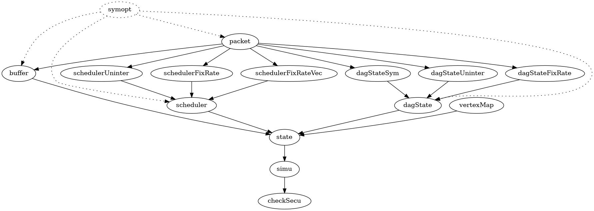

# README

## Environment Setup

You can either use Docker or Vagrant+VirtualBox.

For docker:

1. Run `docker-compose up -d` to build up the container.
2. Run `docker-compose exec dagguise-formal bash` to login to the container.
3. Run `docker-compose down --rmi all` to clean up. (`docker system prune` can further clean up the cache, including your cache for other projects.)

For Vagrant+VirtualBox:

1. Run `vagrant up ` to build up the virtual machine.
2. Run `vagrant ssh` to login to the virtual machine.
3. Run `vagrant destroy` to clean up.

## Run Verification

In the container or virtual machine:

1. `cd /DAGguise-noninterference`
2. `raco test src/checkSecu.rkt`

Further more, you can try

1. `raco test ++arg --cycle ++arg 5 src/checkSecu.rkt` to see 5-induction does not work. (Take 5 mins)
2. `raco test ++arg --cycle ++arg 6 src/checkSecu.rkt` or simply `raco test src/checkSecu.rkt` to see 6-induction works. (Take 40 mins)

## Explain Code

### File Structure

The figure below visualize the coder structure in `src` folder:

From roots to the leaves, we have:

- symopt: For performance only, is used to simplify the symbolic expressions. They are disabled since we do not have performance issues.
- packet: The data structure that save the packet transfer in the system.
- buffer: First-in-first-out buffer
- scheduler[Uninter/FixRate/FixRateVex]: They are different implementations of scheduler. We use schedulerFixRate for the paper.
- dagState[Sym/Uninter/FixRate]: They are different dag that will be used as Transmitters, Receivers, and defense dag. We use dagStateSym for the paper.
- vertexMap: a book-keeping structure in Shaper that maps nodes in defense dag to transmitter's memory requests (packets).
- state: saving the state of whole system, including transmitter, shaper, receiver, and scheduler.
- simu: run the simulation of the system based on a state.
- checkSecu: define the symbolic value, and simulate the system with symbolic initial states.

### Name Conventions

There are generally 2 types of functions.

  - update a data structure: We use verb-object! (e.g. simuRespFor-dagState!) to name these functions.
  - based on the content of data structure, either simply get the content, or do some computation: We use object-info (e.g. dagState-req) to name these functions.

